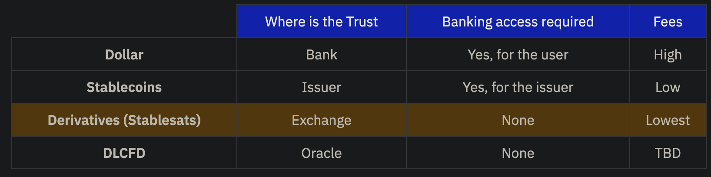

# Stablesats

The below is copied from [stablesats.com](https://stablesats.com)

## Transact USD over Lightning without stablecoins or fiat integration

## Why Stablesats

One problem that persists for people in a Bitcoin economy is the short-term volatility of the bitcoin exchange rate. When the bitcoin price drops, it can lessen the purchasing power of sats and make it harder to pay for dollar-priced goods and services. This creates friction and uncertainty, causing merchants and consumers to frequently consider selling bitcoin for dollars to ensure they can meet their financial obligations.

This problem led Galoy to create a feature called Stablesats, a USD account that people can use to hold "dollar equivalent" balances in their Lightning wallet, thus protect themselves from fluctuations in the bitcoin exchange rate.

Users of Bitcoin Beach Wallet now have a BTC account and a USD account. Both accounts can be used to send and receive bitcoin, and users can instantly transfer value between these accounts. Value held in the USD account will not fluctuate with the price of Bitcoin.

## How it Works

The current Stablesats implementation uses the bitcoin derivatives market, specifically an instrument called perpetual inverse swap to create synthetic USD.

The video below outlines the basic mechanics of this strategy.

In the future, adding more exchanges, hedging strategies and currencies can drive resiliency and optionality for Bitcoin banks and their users. Ultimately, we can unlock the ability for every Lightning user to choose their own units of account without ever leaving the network.

There are also other interesting avenues to explore such as matching the duration of the liabilities just like insurance companies do (short-term with short-term instrument strategies, long-term with long-term).

## Brief History of Synthetic USD

Methods for creating synthetic USD have been discussed and implemented for many years:

In 2015, Arthur Hayes outlined [how to create, store, and spend synthetic USD](https://blog.bitmex.com/in-depth-creating-synthetic-usd/).
In 2021, the [Standard Sats](https://standardsats.github.io/) project introduced the idea of "eurobitcoins" during a hackathon.
In early 2022 Kollider [published a Twitter thread](https://twitter.com/kollider_trade/status/1496507594214723590) recapping ideas and projects under the "synthetic stablecoins on Lightning."

The time for synthetic fiat currencies has arrived. Bitcoin banks using Stablesats can deliver a meaningful solution to millions of Lightning Network users seeking volatility protection.

## Comparing the Alternatives

Stablesats offers a third option for Bitcoin banks wishing to solve the volatility problem for their users. The chart below compares some of the tradeoffs between the two typical options - stablecoins and fiat banking integration - and points to a future fourth option based on Discreet Log Contracts (DLCs).

