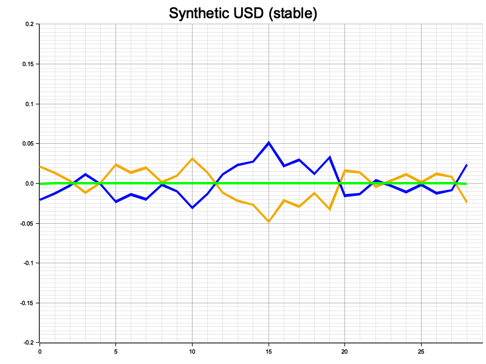
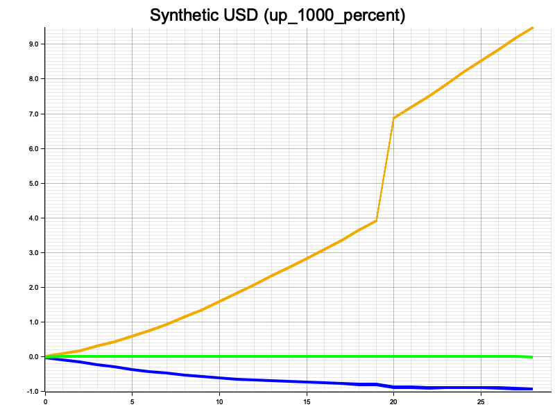
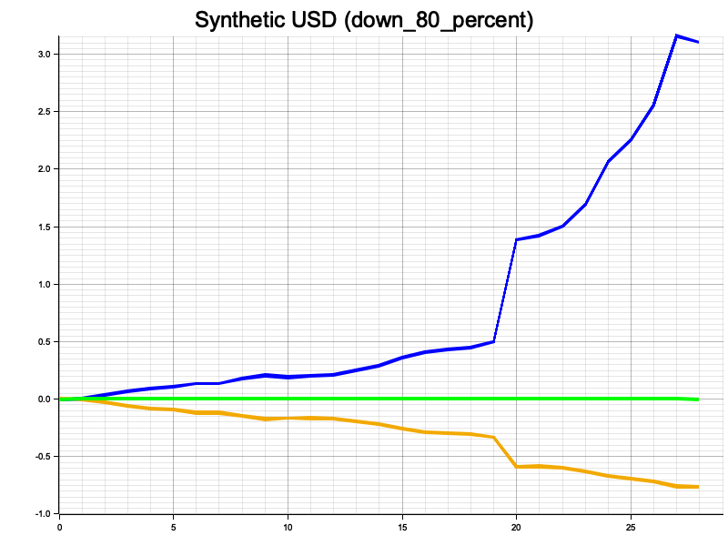

# Visualizing how Synth USD responds to volatile bitcoin price fluctations

The Rust code block below lets you visualize how Synthetic USD responds to volatile Bitcoin price fluctuations by simulating three different scenarios: stable, up 1000%, and down 80%. OKX will be adding synthetic USD simulations to its own trading sandbox in the coming months. The code generates Bitcoin price data for each scenario and calculates the corresponding Synthetic USD values based on inverse swap values. It then calculates the percentage moves for Bitcoin prices, inverse swap values, and Synthetic USD values for each scenario.





The visualizations demonstrate that even in extreme price swings, the Synthetic USD value remains remarkably stable, highlighting the resilience of this innovative financial instrument. This stability is achieved through the inverse relationship between Bitcoin prices and inverse swap values, effectively mitigating the impact of drastic market fluctuations on Synthetic USD. The significance of this capability cannot be overstated, as it has profound implications for human freedom and sovereignty. By enabling individuals to create and manage stable financial assets independently, without relying on traditional banking systems, Synthetic USD presents an invaluable tool for safeguarding financial autonomy in the face of increasing regulatory pressures. This innovative solution empowers people to maintain control over their assets and financial transactions, promoting individual liberty and resistance against centralized financial control.

This code should run in line, however if not you can copy it into a fresh project with...

1. `cargo init synth_usd_vis && cd synth_usd_vis`
2. set the `cargo.toml` dependencies to:

```toml
[dependencies]
plotters = "0.3.4"
rand ="0.8.5"
```

then copy the code block into src/main.rs

```rust,editable
use plotters::prelude::*;
use rand::Rng;

fn main() -> Result<(), Box<dyn std::error::Error>> {
    // Generate 3 different scenarios
    let scenarios = vec![
        ("stable", 1.0, 1.0),
        ("up_1000_percent", 1.0, 11.0),
        ("down_80_percent", 1.0, 0.2),
    ];

    for (name, start_multiplier, end_multiplier) in scenarios {
        let p = format!("synthetic_usd_chart_{}.png", name);
        let backend = BitMapBackend::new(&p, (800, 600));
        let root = backend.into_drawing_area();
        _ = root.fill(&WHITE);

        let bitcoin_prices =
            generate_bitcoin_prices(40000.0 * start_multiplier, 40000.0 * end_multiplier);
        let inverse_swap_values: Vec<f64> = bitcoin_prices
            .iter()
            .map(|price| 1.0 / (price / 1000000.0))
            .collect();

        let synthetic_usd_values: Vec<f64> = bitcoin_prices
            .iter()
            .zip(inverse_swap_values.iter())
            .map(|(price, inverse)| price * inverse)
            .collect();

        let bitcoin_price_pct_moves = calculate_pct_moves(&bitcoin_prices);
        let inverse_swap_pct_moves = calculate_pct_moves(&inverse_swap_values);
        let synthetic_usd_pct_moves = calculate_pct_moves(&synthetic_usd_values);

        let max_pct_move = if name == "stable" {
            0.2
        } else {
            bitcoin_price_pct_moves
                .iter()
                .chain(inverse_swap_pct_moves.iter())
                .chain(synthetic_usd_pct_moves.iter())
                .cloned()
                .fold(f64::MIN, f64::max)
        };

        let min_pct_move = if name == "stable" {-0.2} else {-1.0};

        let mut chart = ChartBuilder::on(&root)
            .caption(
                &format!("Synthetic USD ({})", name),
                ("Arial", 30).into_font(),
            )
            .margin(5)
            .x_label_area_size(30)
            .y_label_area_size(60)
            .build_cartesian_2d(0..29, min_pct_move..max_pct_move)?;

        chart.configure_mesh().draw()?;

        let bitcoin_series = LineSeries::new(
            bitcoin_price_pct_moves
                .iter()
                .enumerate()
                .map(|(x, y)| (x as i32, *y)),
            ShapeStyle::from(&RGBAColor(242, 169, 0, 1.0)).stroke_width(3),
        );

        let inverse_swap_series = LineSeries::new(
            inverse_swap_pct_moves
                .iter()
                .enumerate()
                .map(|(x, y)| (x as i32, *y)),
            ShapeStyle::from(&BLUE).stroke_width(3), // Green with thicker line
        );

        let synthetic_usd_series = LineSeries::new(
            synthetic_usd_pct_moves
                .iter()
                .enumerate()
                .map(|(x, y)| (x as i32, *y)),
            ShapeStyle::from(&GREEN).stroke_width(3), // Blue with thicker line
        );

        chart.draw_series(bitcoin_series)?;
        chart.draw_series(inverse_swap_series)?;
        chart.draw_series(synthetic_usd_series)?;

        root.present()?;
    }

    Ok(())
}

fn generate_bitcoin_prices(start_price: f64, end_price: f64) -> Vec<f64> {
    let mut rng = rand::thread_rng();
    let mut prices = Vec::new();
    let mut price = start_price;

    for i in 0..30 {
        let pct = i as f64 / 30.0;
        let target_price = start_price + pct * (end_price - start_price);
        let mut delta = (target_price - price) * 0.1;
        if i > 20 {
            // After 20 iterations, increase delta to create a more pronounced spike
            delta *= 10.0;
        }
        price += rng.gen_range(-1000.0..1000.0) + delta;
        prices.push(price);
    }

    prices
}

fn calculate_pct_moves(prices: &[f64]) -> Vec<f64> {
    let mut pct_moves = Vec::new();
    let start_price = prices[0];
    for i in 1..prices.len() {
        let pct_move = (prices[i] - start_price) / start_price;
        pct_moves.push(pct_move);
    }
    pct_moves
}
```
